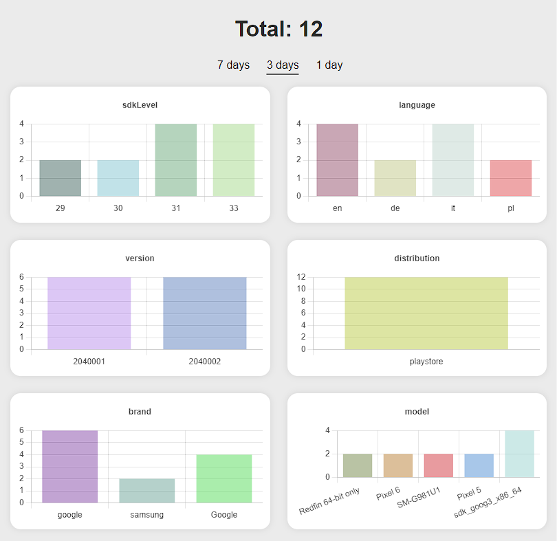

# Report Anyting

  

A simple analytics tool that stores and visualises generic data. Built with express for the API and lowdb as 'database'. Also provides a clean and simple webpage for visualisation, see [screenshot](#screenshot).

You can run this either using the docker image (casperverswijvelt/report-anything:latest), or run this using node directly.

## REST API

### POST `/api/report`

Log data to the database using this call. Static data is data that does not change for a given reported instance, e.g. brand and model name of a smartphone. Dynamic data, well, **does** change, e.g. application version, language, OS version.

As key/value pairs you can have properties that can have just a single value (see "language" in example below), or properties that can have multiple values (see "tiles" in example below). Each individual property will result in a bar chart on the webpage.


Minimal required data:
```
{
    "static": {
        "uuid": "<unique identifier for the reported instance>"
    }
}
```

Example:
```
{
   "static" {
      "uuid": "a3b0bfeb-c651-4cb8-919f-ebab02f5089b",
      "brand": "Google",
      "Model": "Pixel 6"
   },
   "dynamic": {
     "version": "v2.4.0",
     "sdkLevel": 33,
     "language": "en",
     "tiles": {
         "internet": false,
         "wifi": true,
         "data": true,
         "nfc": false
      }
   }
}
```

### GET `/api/reports?since=<unix timestamp in ms>`

Example: `/api/reports`
If no `since` value is given, this will default to 3 days back in time

Example: `/api/reports?since=1663433787890`

Example response:
```
{
   "total":12,
   "properties":{
      "sdkLevel":{
         "29":2,
         "30":2,
         "31":4,
         "33":4
      },
      "language":{
         "en":4,
         "de":2,
         "it":4,
         "pl":2
      },
      "version":{
         "2040001":6,
         "2040002":6
      },
      "distribution":{
         "playstore":12
      },
      "brand":{
         "google":6,
         "samsung":2,
         "Google":4
      },
      "model":{
         "Redfin 64-bit only":2,
         "Pixel 6":2,
         "SM-G981U1":2,
         "Pixel 5":2,
         "sdk_goog3_x86_64":4
      },
      "tiles": {
         "internet": 6,
         "data": 5,
         "nfc": 4,
         "wifi": 8
      }
   }
}
```

## Screenshot
